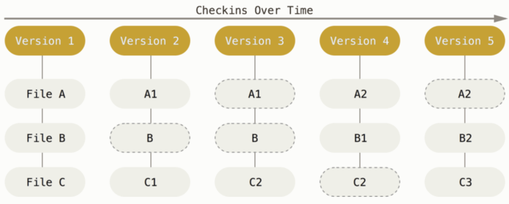
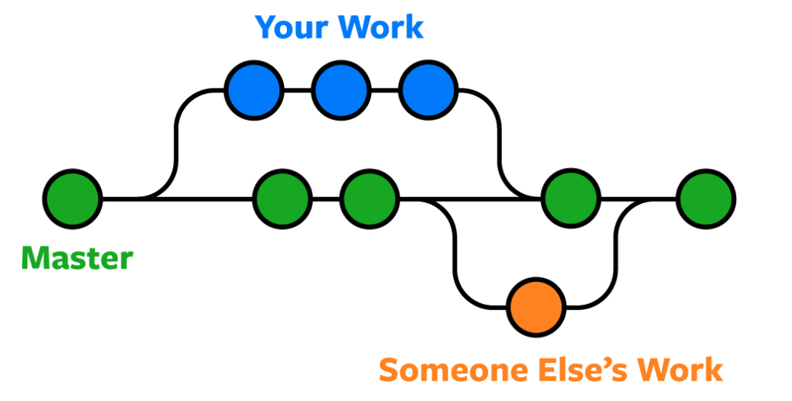
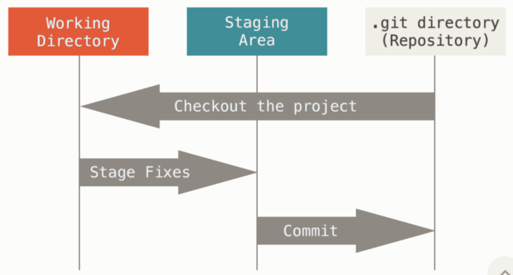

# Git

## What is Git?

**Git** is the most popular version control system, widely used for tracking
changes in source code during software development.



### Key Features of Git

- **Local Storage**: Git is software that runs locally on your computer. Your
  files and their history are stored on your machine.
- **Change Tracking**: Git tracks the changes you make to files, allowing you to
  see a history of modifications.
- **Collaboration**: Git simplifies collaboration by enabling multiple
  developers to merge their changes into one source.



## Git Repositories

A **Git repository** is a hidden subfolder within your project directory that
contains all of your project files and the entire revision history.

## The Three States of Git

Git files can reside in one of three states: modified, staged, and committed.

- **Modified**: Changes have been made to the file(s) but not yet committed.
- **Staged**: Changes have been added to the staging area and are ready to be
  committed.
- **Committed**: Changes have been committed and saved to the local repository.



## Git Branching

Git allows you to create branches, enabling you to work on different features or
fixes without affecting the `main` branch. This facilitates parallel development
by multiple developers.


## Git Merging

**Git merge** combines two separate development histories into one. For
instance, you can merge changes from a feature branch into the `main` branch to
integrate new features or bug fixes.

## Common Git Commands

### Configuring Git

Set your Git username:

```sh
git config --global user.name "Your GitHub Username"
```

Set your Git email:

```sh
git config --global user.email "your.email@example.com"
```

Set VS Code as the default editor:

```sh
git config --global core.editor "code --wait"
```

Handle end-of-line configurations:

- For macOS or Linux:

  ```sh
  git config --global core.autocrlf input
  ```

- For Windows:

  ```sh
  git config --global core.autocrlf true
  ```

View all global configurations in VS Code:

```sh
git config --global -e
```

### Initializing and Checking Status

Initialize an empty Git repository:

```sh
git init
```

List all untracked files:

```sh
git status
```

### Staging and Committing Changes

Add a file to the staging area:

```sh
git add <file-name>
```

Add all files to the staging area:

```sh
git add .
```

Remove a file from the staging area:

```sh
git reset <file-name>
```

Commit changes with a descriptive message:

```sh
git commit -m "Descriptive message"
```

### Stashing Changes

Save changes temporarily without committing them:

```sh
git stash
```

Restore stashed changes:

```sh
git stash apply
```

### Branching and Merging

Create a new branch:

```sh
git branch <branch-name>
```

Switch to a new branch:

```sh
git checkout <branch-name>
```

Create a new branch and switch to it:

```sh
git checkout -b <branch-name>
```

### Reverting and Resetting

Revert a commit:

```sh
git revert <commit-hash>
```

Reset changes:

```sh
git reset
```

### Viewing History and Differences

Display the most recent commits:

```sh
git log
```

Compare changes between commits:

```sh
git diff
```

### Rebase

Integrate changes from one branch onto another:

```sh
git rebase <branch-name>
```
